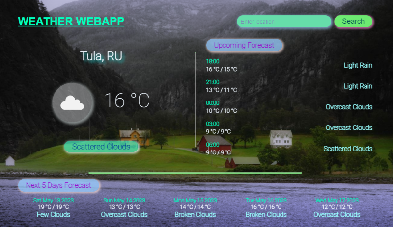

# Weather web aplication using OpenWeatherMap API
#### What has been implemented:
* weather app has responsive screen width for mobile and desktop
* weather app has a search bar
* link OpenWeatherMap API to get weather data and display weather forecast
* using javascript to display weather forecast in in pre-created HTML
* click here => [_**WeatherApp**_](https://bakna2t.github.io/weather/)
___
